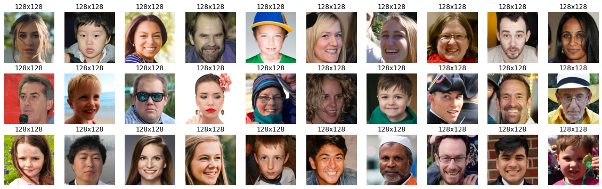
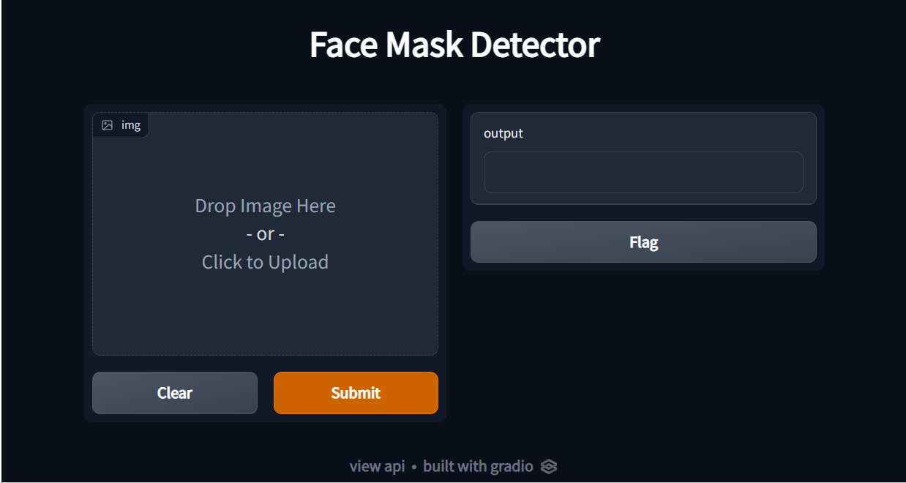

# Face-Mask-Detection
 Face Mask Detection From Images Using Mobilenet
 
### This project is aimed to develop an application that can detect whether a person is wearing a face mask or not. 
 
## Dataset

The dataset used to train the face mask detection system is the "FaceMask Dataset Covid-19(10k Images 2 Folders)" dataset from Kaggle (https://www.kaggle.com/datasets/muhammadahsan026/facemask-dataset-covid1910k-images-2-folders). The dataset consists of 10K images of faces, with and without masks.

In this project, I have implemented a Mobilenet convolutional neural network that takes an image of a person's face and predicts whether the person is wearing a mask or not. 

The input image is a color image with dimensions of 100x100x3. The output of the neural network is a  prediction probability.

In this be used a Mobilenet Neural Netowork without pretraining weights. The first 11 layers are depthwise separable convolutional layers with 3x3 kernels. The final layer is a 1x1 convolutional layer with a sigmoid activation. 

## The project is developed using the following tools and libraries:
- TensorFlow 2.0
- Keras
- NumPy
- Opendatasets
- Pillow
- Gradio
- matplotlib

## Gradio Deployed Model

